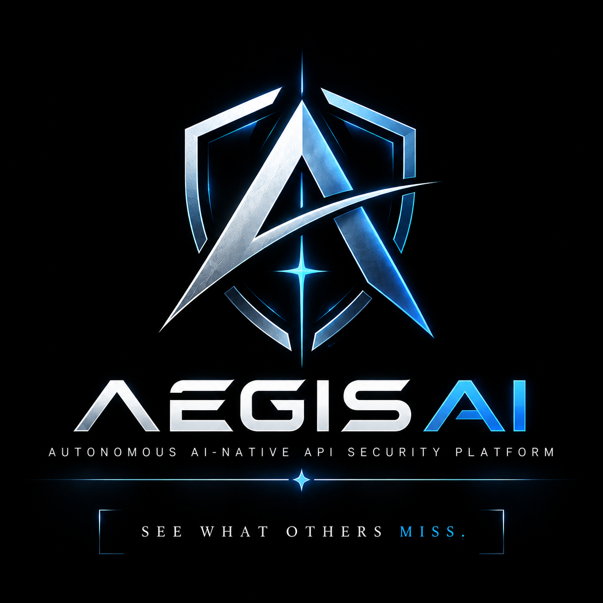

<p align="center">
  
</p>

<h1 align="center">AegisAI</h1>

<p align="center">
  <strong>Autonomous AI-Native API Security Platform</strong>
</p>

<p align="center">
  <em>We see what others miss.</em>
</p>

---

## Overview

**AegisAI** is an AI-native API security platform being developed to analyze modern API ecosystems from multiple security perspectives rather than relying on a single detection technique.

The project combines **API discovery, structured security analysis, behavioral intelligence, graph-based modeling, predictive risk assessment, authorization testing, and explainable security intelligence** into a modular security pipeline.

The long-term goal is to move from simply identifying individual suspicious requests to understanding the **security context of an API ecosystem**:

> **What APIs exist? What do they expose? How are they related? What security properties do they have? Which operations represent meaningful risk? How could an attacker move through the API ecosystem? And how can that risk be explained and acted upon?**

AegisAI is being developed as a research-oriented security engineering project with an emphasis on reproducible experiments, modular architecture, automated testing, and authorized security testing.

---

## Why AegisAI?

Modern applications increasingly depend on APIs for authentication, payments, user data, internal services, mobile applications, microservices, and third-party integrations.

This creates an API attack surface containing more than individual endpoints.

Security analysis may need to understand:

* authentication requirements
* destructive operations
* object identifiers
* sensitive parameters
* request and response structures
* authorization context
* relationships between operations
* object-level operation surfaces
* graph-level security context
* behavioral anomalies
* risk associated with individual API operations
* potential attack paths across an API ecosystem

AegisAI is designed around this broader perspective.

Instead of treating every endpoint as an isolated entity, the project progressively builds a representation of the API ecosystem and combines multiple intelligence layers.

---

# Core Security Pipeline

The intended AegisAI pipeline is:

```text
                    ┌─────────────────────┐
                    │     API Traffic     │
                    └──────────┬──────────┘
                               │
                    ┌──────────▼──────────┐
                    │   Data Processing   │
                    └──────────┬──────────┘
                               │
                    ┌──────────▼──────────┐
                    │    API Discovery    │
                    └──────────┬──────────┘
                               │
                    ┌──────────▼──────────┐
                    │   AI Detection      │
                    └──────────┬──────────┘
                               │
                    ┌──────────▼──────────┐
                    │    API Digital Twin │
                    └──────────┬──────────┘
                               │
                    ┌──────────▼──────────┐
                    │ Graph Intelligence  │
                    └──────────┬──────────┘
                               │
                    ┌──────────▼──────────┐
                    │   Risk Prediction   │
                    └──────────┬──────────┘
                               │
                    ┌──────────▼──────────┐
                    │  Explainable AI     │
                    └──────────┬──────────┘
                               │
                    ┌──────────▼──────────┐
                    │ AI Security Copilot │
                    └──────────┬──────────┘
                               │
                    ┌──────────▼──────────┐
                    │  Response Engine    │
                    └──────────┬──────────┘
                               │
                    ┌──────────▼──────────┐
                    │ Security Dashboard  │
                    └─────────────────────┘
```

The architecture is intentionally modular so individual intelligence layers can be developed, tested, and evaluated independently.

---

# Core Capabilities

| Capability                       | Purpose                                       | Status                    |
| -------------------------------- | --------------------------------------------- | ------------------------- |
| API Discovery                    | Parse and inventory API specifications        | 🟢 Implemented            |
| Endpoint Security Classification | Extract structured security properties        | 🟢 Implemented            |
| Security Feature Extraction      | Convert API semantics into model features     | 🟢 Implemented            |
| Graph Intelligence               | Model API objects and operation relationships | 🟢 Implemented            |
| Target-Aware Graph Context       | Add target-specific graph security context    | 🟢 Implemented            |
| Risk Prediction                  | Predict API risk categories using XGBoost     | 🟢 Foundation implemented |
| Authorization Probing            | Execute controlled authorization probes       | 🟢 Foundation implemented |
| Behavioral Anomaly Detection     | Detect unusual API behavior                   | 🟡 In development         |
| Explainable AI                   | Explain model-driven security decisions       | 🟡 Planned                |
| AI Security Copilot              | LLM-based security analysis and assistance    | 🟡 Planned                |
| Attack-Chain Reconstruction      | Reconstruct multi-step API attack paths       | 🟡 Planned                |
| Response Engine                  | Recommend or automate defensive actions       | 🟡 Planned                |
| Security Dashboard               | Visualize API security intelligence           | 🟡 Planned                |

---

# API Discovery

AegisAI begins by understanding the API itself.

The current discovery layer processes structured API specifications and builds an inventory of API endpoints and object operation surfaces.

Each discovered endpoint can contain information such as:

* HTTP method
* path
* operation category
* operation ID
* summary
* description
* tags
* parameters
* request body
* responses
* authentication requirements
* object identifiers
* sensitive parameters
* sensitive response fields
* security indicators

The discovery layer also groups operations around object-oriented API surfaces.

For example:

```text
/users/{user_id}

GET       → Read
PUT       → Update
DELETE    → Delete
```

This provides the foundation for analyzing relationships between operations instead of treating them as independent endpoints.

---

# Security Feature Representation

AegisAI currently represents endpoint-level security information using a **25-feature security vector**.

The representation includes:

### Authentication & security state

```text
is_authenticated
is_destructive
is_authentication_endpoint
has_sensitive_parameters
```

### Path and parameter structure

```text
has_path_parameters
parameter_count
path_depth
path_parameter_count
query_parameter_count
header_parameter_count
```

### Request-body structure

```text
has_request_body
request_body_property_count
request_body_required_property_count
request_body_max_depth
```

### Response structure

```text
has_response_body
response_body_property_count
response_body_max_depth
```

### HTTP method representation

```text
method_get
method_post
method_put
method_patch
method_delete
```

### Authorization-context signals

```text
is_admin_context
has_user_ownership_context
has_other_user_context
```

The authorization-context features are derived from the semantic information available in the API specification rather than from external vulnerability labels.

This separation is intentional so that documented vulnerability evidence does not become a hidden training feature.

---

# Graph Intelligence

API security problems often involve relationships between operations.

AegisAI therefore builds a graph representation of an API ecosystem.

The current graph model represents:

```text
API Object
    │
    ├── GET
    ├── POST
    ├── PUT
    ├── PATCH
    └── DELETE
```

Current graph-level security features include concepts such as:

* objects with complete operation surfaces
* objects with mutation operations but no read operation
* objects with delete operations but no read operation
* objects with write operations but no read operation
* objects with multiple mutation types
* objects with write and delete operations without read access
* target-specific delete-without-read context

This graph representation provides contextual information that can later be combined with machine-learning models and attack-path analysis.

---

# Security Context

Endpoint features and graph intelligence are combined into a larger security representation.

Current representations include:

```text
25 endpoint features
        +
6 graph-level features
        =
31-feature security context
```

A target-aware representation additionally incorporates target-specific graph information:

```text
31-feature security context
        +
target-aware graph context
        =
32-feature target-aware context
```

The separation between endpoint, aggregate graph, and target-aware intelligence is deliberate.

It allows the individual intelligence layers to evolve independently while keeping the feature representation explicit and testable.

---

# Risk Prediction

AegisAI currently includes an XGBoost-based risk prediction foundation.

The model operates on the graph-aware security context rather than directly consuming the derived graph risk score.

The current prediction classes are:

```text
low
medium
high
critical
```

The training pipeline uses:

* structured security-context features
* synthetic training scenarios
* stratified cross-validation
* deterministic experiment configuration
* explicit dataset schema validation

The current implementation deliberately excludes the derived `graph_context_score` from the model input because that value is constructed from the same underlying risk logic used to generate the training labels.

This prevents that derived score from becoming a direct source of target leakage.

### Important evaluation note

The current training dataset is synthetic and its labels are generated from AegisAI's deterministic risk rules.

Therefore, high cross-validation performance on this dataset should **not** be interpreted as proof of real-world detection accuracy.

Future evaluation will focus on independent datasets, documented vulnerabilities, controlled authorization tests, and more realistic security telemetry.

---

# Authorization Security Testing

AegisAI now contains the foundation for controlled authorization probing.

The current authorization layer provides:

```text
AuthorizationProbe
        │
        ▼
AuthorizationProbeClient
        │
        ▼
AuthorizationProbeResult
```

A probe can describe:

* HTTP method
* target URL
* headers
* query parameters
* request body

The result currently captures:

* HTTP status code
* response time
* response size

The probe client uses Python's standard library and is intentionally kept independent of the model layer.

This separation allows future authorization analysis to compare controlled requests and responses without coupling request execution directly to the prediction engine.

All security testing should be performed only against systems for which testing is explicitly authorized.

---

# Explainable AI

Explainability is a planned intelligence layer of AegisAI.

The intended system will eventually answer questions such as:

```text
Why was this endpoint considered risky?

Which security properties contributed to the prediction?

Which graph relationships increased contextual risk?

Which model features were most influential?

What evidence supports the finding?
```

Planned technologies include:

* SHAP
* structured risk factors
* evidence-backed explanations
* natural-language security summaries

The goal is to make model output useful to security engineers rather than exposing only a numerical prediction.

---

# AI Security Copilot

AegisAI is planned to include an AI security copilot capable of working with the platform's structured security intelligence.

Potential capabilities include:

* explaining security findings
* summarizing API attack surfaces
* investigating suspicious behavior
* correlating findings
* explaining attack paths
* querying the API security graph
* generating remediation guidance
* assisting security analysts during investigations

Planned technologies include:

* LLMs
* Retrieval-Augmented Generation (RAG)
* structured security context
* API security knowledge
* vulnerability evidence

The copilot is currently a planned component and is not represented as an implemented feature.

---

# Planned AI / ML Stack

AegisAI is designed to support multiple complementary approaches rather than relying on a single model.

| Technology              | Intended Role                         | Status                    |
| ----------------------- | ------------------------------------- | ------------------------- |
| XGBoost                 | Structured API risk prediction        | 🟢 Foundation implemented |
| Isolation Forest        | Unsupervised anomaly detection        | 🟡 Planned                |
| Autoencoder             | Behavioral anomaly detection          | 🟡 Planned                |
| Transformer             | Sequence/behavior modeling            | 🟡 Planned                |
| Graph Attention Network | Graph-aware security reasoning        | 🟡 Planned                |
| SHAP                    | Model explainability                  | 🟡 Planned                |
| LLM                     | Security analysis and copilot         | 🟡 Planned                |
| RAG                     | Grounded security knowledge retrieval | 🟡 Planned                |

These components are intended to complement one another rather than being treated as interchangeable models.

---

# Evidence and Evaluation

AegisAI follows a separation between:

```text
Model prediction
        │
        ├── Independent
        │
        ▼
Documented security evidence
```

Documented vulnerabilities can therefore be used to evaluate whether the system identifies meaningful security properties without directly turning those vulnerability labels into model inputs.

The current project includes independent security evidence for documented OWASP crAPI scenarios involving:

* Broken Function Level Authorization (BFLA)
* Broken Object Level Authorization (BOLA)

These cases are being used as evaluation evidence rather than as training labels.

---

# Testing

AegisAI uses automated testing throughout the development process.

Current test coverage includes:

* API discovery
* endpoint classification
* feature extraction
* feature schema validation
* graph construction
* graph feature extraction
* security-context construction
* training-data generation
* risk prediction data loading
* XGBoost model behavior
* authorization models
* authorization probe execution
* API risk-assessment endpoints

Current verified test status:

```text
154 passed
```

The project treats automated regression testing as part of the development workflow rather than as a final-stage activity.

---

# Current Implementation

### Implemented

* OpenAPI API discovery
* Endpoint inventory
* Endpoint security classification
* Sensitive parameter detection
* Sensitive response-field detection
* Object identifier extraction
* Object operation surface modeling
* 25-feature endpoint security representation
* API security graph construction
* Graph security features
* Target-aware graph features
* 31-feature security context
* 32-feature target-aware security context
* Synthetic graph-aware training data generation
* Risk prediction dataset validation
* XGBoost risk prediction foundation
* Stratified cross-validation experiment
* Independent security evidence evaluation
* Controlled authorization probe models
* Controlled authorization probe client
* Automated regression test suite

### In Development

* Expanded risk-prediction experiments
* More realistic security datasets
* Behavioral anomaly detection
* Advanced graph security analysis
* Authorization behavior analysis
* Explainability pipeline
* Security evidence correlation

### Planned

* Isolation Forest anomaly detection
* Autoencoder behavioral detection
* Transformer-based behavioral modeling
* Graph Attention Networks
* SHAP-based explanations
* LLM security copilot
* RAG security knowledge layer
* Attack-chain reconstruction
* Automated response recommendations
* Real-time API telemetry pipeline
* Security dashboard
* Extended evaluation against real-world API security scenarios

---

# Repository Structure

```text
AegisAI/
│
├── ai/
│   ├── authorization/
│   │   ├── client.py
│   │   └── models.py
│   │
│   ├── graph_intelligence/
│   │   ├── builder.py
│   │   ├── features.py
│   │   ├── models.py
│   │   └── schema.py
│   │
│   ├── risk_prediction/
│   │   ├── cross_validation.py
│   │   ├── data_loader.py
│   │   └── xgboost_model.py
│   │
│   ├── security_context.py
│   ├── security_context_features.py
│   └── security_context_schema.py
│
├── api_discovery/
│   ├── models.py
│   └── parser.py
│
├── backend/
│   └── app/
│       ├── api/
│       ├── core/
│       ├── models/
│       └── main.py
│
├── risk_engine/
│   ├── features.py
│   ├── models.py
│   ├── schema.py
│   └── scorer.py
│
├── scripts/
│   ├── generate_training_data.py
│   ├── generate_graph_scenarios.py
│   ├── run_risk_prediction_experiment.py
│   └── write_graph_training_data.py
│
├── tests/
│   ├── test_authorization_client.py
│   ├── test_authorization_models.py
│   ├── test_graph_intelligence.py
│   ├── test_risk_features.py
│   ├── test_risk_prediction_data_loader.py
│   ├── test_security_context_features.py
│   └── ...
│
├── data/
├── docs/
├── assets/
│   └── aegisai-logo.png
│
├── requirements.txt
└── README.md
```

---

# Installation

## Requirements

AegisAI is currently developed and tested with:

* Python 3.11
* Linux / WSL2 development environment
* Git
* Python virtual environment
* CUDA-capable hardware can be used for compatible workloads, although individual components may use CPU execution where required

### Clone the repository

```bash
git clone https://github.com/BobCat007/AegisAI.git
cd AegisAI
```

### Create a virtual environment

```bash
python3.11 -m venv .venv
source .venv/bin/activate
```

### Install dependencies

```bash
pip install -r requirements.txt
```

---

# Running the API

Start the FastAPI backend with:

```bash
uvicorn backend.app.main:app --reload
```

The development server will be available at:

```text
http://127.0.0.1:8000
```

FastAPI's interactive documentation can then be accessed through the development server's Swagger/OpenAPI interface.

---

# Running the Test Suite

Run the complete automated test suite:

```bash
pytest -q
```

The current development baseline contains:

```text
154 passed
```

The test suite is expected to remain green as new security-analysis modules are introduced.

---

# Running Risk Prediction Experiments

The current risk-prediction experiment uses the generated graph-aware training dataset.

```bash
python scripts/run_risk_prediction_experiment.py
```

The experiment performs stratified cross-validation and reports:

* number of samples
* feature count
* number of folds
* validation samples
* accuracy
* macro precision
* macro recall
* macro F1

Results from the current synthetic dataset should be interpreted as **pipeline validation**, not as evidence of real-world model generalization.

---

# Development Philosophy

AegisAI is being developed around several principles.

### 1. Security context over isolated signals

An endpoint should not always be evaluated independently of its surrounding API ecosystem.

### 2. Multiple intelligence layers

Different security problems require different analytical approaches.

```text
Rules
  +
Structured Features
  +
Graph Context
  +
Machine Learning
  +
Security Evidence
  +
Explainability
```

### 3. Explicit feature representations

Security-relevant model inputs should be inspectable and reproducible.

### 4. Avoiding evaluation leakage

Evidence used to evaluate security behavior should not silently become training information.

### 5. Reproducible experiments

Experiments should have explicit datasets, feature definitions, labels, evaluation procedures, and deterministic configuration where practical.

### 6. Continuous testing

New security intelligence should be accompanied by automated tests.

---

# Roadmap

```text
v0.1
 │
 ├── API discovery
 ├── Security classification
 ├── Feature representation
 ├── Graph intelligence
 ├── Risk prediction foundation
 └── Authorization probing
       │
       ▼
v0.2
 │
 ├── Expanded risk experiments
 ├── Behavioral anomaly detection
 ├── Authorization analysis
 └── Security evidence correlation
       │
       ▼
v0.3
 │
 ├── Explainable AI
 ├── Advanced graph analysis
 └── Attack-chain reconstruction
       │
       ▼
v0.4
 │
 ├── LLM security copilot
 ├── RAG security knowledge
 └── Analyst investigation workflows
       │
       ▼
v0.5
 │
 ├── Real-time telemetry
 ├── Response engine
 └── Security dashboard
       │
       ▼
v1.0
 │
 └── Integrated API security intelligence platform
```

The roadmap is intentionally subject to change as research and evaluation results inform subsequent development.

---

# Research Directions

AegisAI is being developed around several security research directions:

* AI-assisted API security
* API attack-surface discovery
* behavioral anomaly detection
* graph-based API security analysis
* authorization and access-control testing
* API attack-path reconstruction
* explainable security AI
* machine-learning-assisted risk assessment
* security evidence correlation
* LLM-assisted security analysis
* grounded security copilots
* automated defensive recommendations

---

# Security & Ethical Use

AegisAI is developed for:

* educational research
* cybersecurity experimentation
* defensive security engineering
* authorized penetration testing
* security analysis of systems you own or have explicit permission to test

Authorization-probing functionality should only be used against systems where testing is explicitly permitted.

Do not use AegisAI to access, disrupt, probe, or attack systems without authorization.

The project is intended to support defensive security research and engineering.

---

# Contributing

AegisAI is currently an actively developed research project.

Potential contributions include:

* API security research
* detection algorithms
* graph-analysis techniques
* machine-learning experiments
* explainability methods
* testing
* documentation
* security datasets
* visualization
* defensive automation

For substantial changes, please open an issue first to discuss the proposed approach.

---

# Project Status

**Current version:** `0.1.0`

**Development status:** Active development

**Current focus:**

```text
API Discovery
      ↓
Security Feature Representation
      ↓
Graph Intelligence
      ↓
Risk Prediction
      ↓
Authorization Analysis
```

The project is currently focused on establishing a reliable security-intelligence foundation before adding more complex AI components.

---

<p align="center">
  <strong>AegisAI</strong>
  <br>
  Autonomous AI-Native API Security Platform
  <br><br>
  <sub>Securing tomorrow, one API at a time.</sub>
</p>

---

## Disclaimer

AegisAI is developed for educational, research, and authorized security testing purposes.

The project is under active development. Features described as planned or in development should not be interpreted as currently available functionality.

